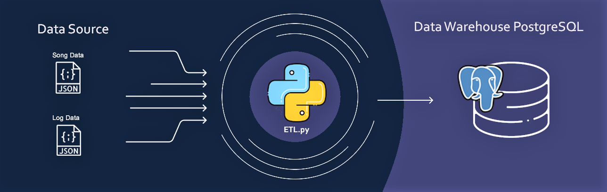
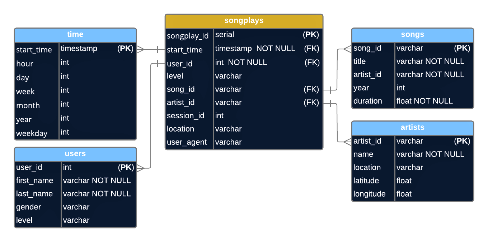

# Building a data model and an ETL data pipeline 
## 🛠 Project Structure:
1. Dimensional Data Modeling 
2. Data extraction
3. Loading data into a Data Warehouse based in PostgreSQL

### Repository Structure 📂

    ├── data                   # .JSON files 
    |    ├── song_data         # Contains song's informations and metadata. 
    │    └── log_data          # Contains user's informations and activities logs.
    ├── create_tables.py       # Connects to the database, create/drop tables; 
    ├── sql_queries.py         # SQL queries (CREATE/DROP/INSERT/DELETE statements and Joins);
    ├── elt.py                 # Extracts data from sources, transform and loads into the tables;
    ├── test.ipynb             # Contains SQL queries to test the final load and results in the tables; 
    └── README.md

## Data Pipeline in a Music Streaming App 🎼 
- In a music streaming app, the data analytics team `analyzes data collected to understand the users habits and interests` 
in order to identify opportunities for improvement in the services, targeting business growth and optimization. 
- The data that needs to be analyzed are stored in different places making it difficult to analyze using SQL queries. 
- In order to achieve a simpler way to analyze the data, an otimized datawarehouse was build to stored all the data together, in a strutured aggregated way using dimensions.   
- This method simplified the data analytics team way of doing queries and provide an easy and faster results for the business strategy . 

## Data Modeling 💾
This case simulates a music streaming app activities.       
Two distinct sources were used:   
- Sub dataset of ["Milion Song Dataset"](http://millionsongdataset.com/) contains songs info and metadata.
- Logs and info generated by ['Eventsim'](https://github.com/Interana/eventsim) to simulate real users usage.
> All data is structured in .json files.

**The data were modeled with the goal of optimizing the SQL query process.**  
- A denormalized star schema was created. 
- The fact table"songplays" gives us the info of the song listened in a given activity log. 
- The dimensional tables provides us with additional details of the facts table.

## Data Pipeline ⚙
`sql_queries.py` is a module to be imported by ETL.py.   
`create_tables.py` is a python script to run in the development phase, in order to create new tables and drop old ones.   
`ETL.py` is the main script that connect to the database, extract/process/load data into the datawarehouse. 
 
#### How to execute
1. Execute `$ python create_tables.py`;
2. Execute `$ python etl.py`;

👍

